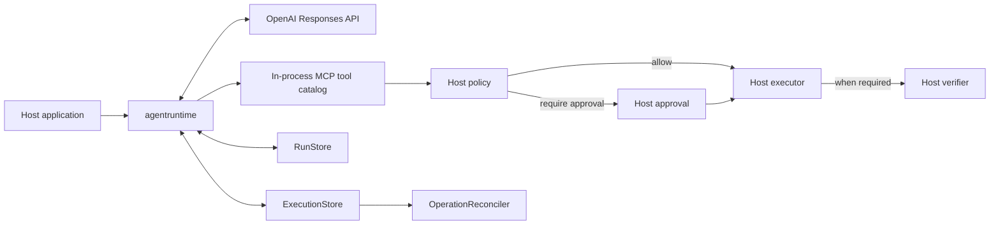

# agentruntime

[](https://github.com/ly95/agentruntime/actions/workflows/ci.yml)
[](https://pkg.go.dev/github.com/ly95/agentruntime)
[](LICENSE)

> **Status:** `agentruntime` is pre-1.0. The public API may change between minor
> versions while the runtime contracts are refined.

`agentruntime` is an embeddable Go runtime for agents built on the OpenAI Responses
API. It owns the model/tool loop while the host application keeps control of
authorization, approvals, persistence, side effects, verification, and domain
behavior through explicit interfaces.

The project is intended for applications that need production-oriented tool
execution semantics without adopting an HTTP server, database, queue, UI, or
product framework from the runtime.

## Why agentruntime

- Embed a complete streaming model/tool loop in an existing Go application.
- Expose JSON Schema-validated operation contracts to the model through an
  in-process MCP server.
- Keep policy, human approval, execution, and independent verification under
  host control.
- Resume approvals and stateful conversations without giving the model
  authority over persisted state.
- Protect writes with durable plans, idempotent execution records, session
  leases, fencing, and reconciliation.
- Observe the runtime through structured events without coupling it to an
  application transport or storage implementation.

`agentruntime` deliberately does not provide application handlers, database
implementations, queue workers, built-in domain tools, billing rules, product
prompts, or a remote MCP client.

## Architecture and trust boundaries



MCP discovery only exposes operation contracts to the model; it never grants
permission. Every operation is evaluated by host policy before execution. A
confirmation-required write cannot complete successfully without a positive
verifier result.

| Runtime owns | Host application owns |
| --- | --- |
| Model iteration and OpenAI event mapping | API keys, model selection, and product instructions |
| In-process MCP discovery and JSON Schema validation | Authorization and capability policy |
| Approval pause/resume orchestration | Approval UI and approval decisions |
| Transcript, lease, plan, and execution state transitions | Durable `RunStore` and `ExecutionStore` implementations |
| Verification and reconciliation orchestration | Side effects, receipts, verification logic, and reconciliation decisions |
| Context-window and attachment protocols | Domain data, attachment resolution, and trusted external context |

## Core concepts

| Type | Purpose |
| --- | --- |
| `Model` / `OpenAIModel` | Streams model output into the runtime's provider-neutral event contracts. |
| `OperationRegistry` / `Operation` | Defines immutable operation names, schemas, effects, capabilities, and confirmation requirements. |
| `OperationPolicy` | Allows, denies, or routes each proposed operation through approval. |
| `OperationExecutor` | Performs the host-owned side effect or read and returns schema-validated output. |
| `Approver` / `ApprovalResumer` | Requests approval and resumes a previously paused run. |
| `ResultVerifier` | Independently confirms the result of confirmation-required operations. |
| `RunStore` | Persists sessions and serializes stateful runs with renewable, generation-fenced leases. |
| `ExecutionStore` | Persists sealed write plans, idempotent execution records, and append-only transitions. |
| `OperationReconciler` | Settles uncertain persisted writes without starting a model run. |
| `ContextWindowConfig` / `EventSink` | Controls transcript compaction and observes structured runtime events. |
| `skills.SkillSet` | Holds immutable, content-addressed Skill snapshots loaded from explicit host-selected sources. |

## Install

```bash
go get github.com/ly95/agentruntime@latest
```

The module requires Go 1.26 or newer.

## Quick start

Set the credentials and model used by the OpenAI Responses API:

```bash
export OPENAI_API_KEY="..."
export OPENAI_MODEL="your-model-name"
```

Then create and run a stateless agent:

```go
package main

import (
	"context"
	"fmt"
	"os"

	"github.com/ly95/agentruntime"
	"github.com/openai/openai-go/v3"
	"github.com/openai/openai-go/v3/option"
)

func main() {
	client := openai.NewClient(
		option.WithAPIKey(os.Getenv("OPENAI_API_KEY")),
		option.WithMaxRetries(2),
	)
	model, err := agentruntime.NewOpenAIModel(client, agentruntime.OpenAIModelConfig{
		Model: os.Getenv("OPENAI_MODEL"),
	})
	if err != nil {
		panic(err)
	}

	runtime, err := agentruntime.NewRuntime(agentruntime.RuntimeConfig{Model: model})
	if err != nil {
		panic(err)
	}

	result, err := runtime.Run(context.Background(), agentruntime.Input{
		User: "Explain why the sky is blue in one paragraph.",
	})
	if err != nil {
		panic(err)
	}
	fmt.Println(result.Output)
}
```

## Mounted Skills

The `skills` package loads every source through the same `SKILL.md` parser,
copies all files into an immutable snapshot, and derives deterministic Skill and
SkillSet hashes. A Runtime freezes the mounted SkillSet at construction and
adds only each Skill's name, description, and `SKILL.md` body to model
instructions. For a new Skill-enabled session, `RunStore.BeginRun` atomically
creates a revision-zero binding state before the first transcript snapshot can
exist; later snapshots retain that SkillSet ID. Implementations must compare the
incoming `RunRecord.SkillSetID` with stored session, waiting-run, and active-run
bindings inside the same transaction, returning `ErrSkillSetMismatch` before
claiming or fencing a lease or changing run status. This binding survives a
first-run failure and abandoned-lease recovery.

Local loading is explicit-only: `NewLocalSource` reads exactly the absolute
directories listed by the host. It never scans `~/.agents/skills`,
`~/.codex/skills`, environment-derived locations, or the working directory.
Local and Codex Plugin directories must be canonical absolute paths with no
symbolic-link components; aliases are rejected instead of resolved. `LoadSet`
closes filesystem resources after snapshotting. A host that calls a built-in
source's public `Resolve` method directly must call `Close` on every returned
`Artifact`.

GitHub access is also host-owned: an injected `GitHubFetcher` resolves the
configured ref to a commit SHA and returns copied `GitHubFile` records rooted at
the requested Skill directory. The source rejects non-regular entry modes,
validates path collisions and limits, and deep-copies all bytes before parsing;
an arbitrary host filesystem is never retained as a confinement boundary.
`GitHubFile.Mode` uses Go's `io/fs.FileMode` permission bits, not raw Git tree
modes. Local and Codex Plugin filesystem sources require descriptor-relative,
no-follow path primitives and fail explicitly on unsupported targets.
Default limits also cap each Skill at 16,384 total filesystem entries, 4,096
bytes per relative path, and 64 path components so empty-directory or deep-path
structures cannot bypass the file and byte limits.

```go
skillSet, err := skills.LoadSet(ctx,
	// Each entry is the Skill directory itself and must contain SKILL.md.
	skills.NewLocalSource(skills.LocalSourceConfig{
		ID: "team-local",
		Directories: []string{
			"/opt/agent-skills/code-review",
			"/opt/agent-skills/release-notes",
		},
	}),
	// githubFetcher is implemented and credentialed by the host. It is called
	// once; the runtime does not add retries or persist its credentials.
	skills.NewGitHubSource(skills.GitHubSourceConfig{
		ID:         "github",
		Repository: "owner/repository",
		Ref:        "v1.2.0",
		Path:       "skills/security-review",
		Fetcher:    githubFetcher,
	}),
	// Plugin directories are explicit installations. The source reads
	// .codex-plugin/plugin.json and imports Skill directories under its skills path.
	skills.NewCodexPluginSource(skills.CodexPluginSourceConfig{
		ID:                "codex-installed",
		PluginDirectories: []string{"/opt/codex-plugins/notion"},
	}),
)
if err != nil {
	return err
}

runtime, err := agentruntime.NewRuntime(agentruntime.RuntimeConfig{
	Model:  model,
	Skills: skillSet,
})
```

Supporting files such as `references/`, `assets/`, `meta.yaml`, and
`agents/openai.yaml` are preserved in the snapshot and covered by its digest,
but this MVP injects only `SKILL.md`. It never executes `scripts/`, loads hooks,
starts Plugin MCP servers, interprets `.app.json`, or implements the rest of the
Codex Plugin runtime.

## Operation requirements

The runtime validates required dependencies when it is constructed:

| Configuration | Required host dependencies |
| --- | --- |
| No registered operations | `Model` only |
| Any registered operation | `OperationPolicy` and `OperationExecutor` |
| Any write operation | `ExecutionStore` in addition to policy and executor |
| `ConfirmationRequired` operation | `ResultVerifier`; approval flows also use `Approver` and `ApprovalResumer` |
| Stateful session | `RunStore` |

Hosts should use stable, tenant-scoped idempotency keys for retried requests,
build approval previews that reveal only safe structured data, and implement the
execution-attempt fence atomically with the external write. Reconcile unresolved
write records before allowing unrelated conversation state to hide them.

## Examples

Runnable examples live in [`examples`](examples/README.md):

| Example | Demonstrates |
| --- | --- |
| [`basic`](examples/basic/main.go) | A stateless agent without tools |
| [`mcp`](examples/mcp/main.go) | A read-only operation exposed through the runtime's in-process MCP server |
| [`skill`](examples/skill/main.go) | An explicitly loaded local `SKILL.md` mounted beside a host-owned operation |

The examples intentionally keep their side effects read-only. Production write
operations require the durable execution, approval, and verification boundaries
described above.

## Compatibility and guarantees

- `OpenAIModel` targets the OpenAI Responses API. Client authentication,
  endpoints, middleware, timeouts, and bounded pre-stream retries are configured
  on the injected `openai.Client`; compatibility with non-OpenAI implementations
  is not guaranteed.
- MCP support is currently an in-process operation-discovery boundary, not a
  client for arbitrary remote MCP servers.
- Invalid configuration, unsupported provider output, missing resources, and
  ambiguous execution outcomes fail explicitly.
- The runtime does not retry semantic model turns or side-effecting operations,
  downgrade, truncate, or substitute a caller choice. An injected provider client
  may perform explicitly configured transport retries before a response stream is
  established.
- Operation contracts are frozen when the runtime is constructed; persisted
  write plans and execution transitions are treated as immutable history.

## Development

```bash
go test ./...
go vet ./...
```

See [CONTRIBUTING.md](CONTRIBUTING.md) before proposing changes. Report
vulnerabilities according to [SECURITY.md](SECURITY.md), not through a public
issue.

## License

`agentruntime` is available under the [MIT License](LICENSE).
